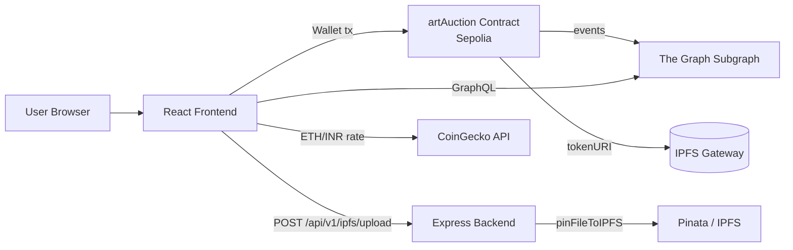

# CURA — Curated Art

**A decentralized Web3 art marketplace where artists mint and sell artwork as NFTs.**

---

## Overview

CURA (Curated Art) is a decentralized art marketplace built for artists and collectors. Artists register on-chain, upload artwork to IPFS, and list pieces for **Direct Sale** or **Auction**. Collectors connect a wallet, browse listings, buy or bid, and manage owned work from a personal studio.

Marketplace state (listings, bids, likes, follows) lives on an ERC-721 smart contract deployed on **Ethereum Sepolia**. The frontend reads indexed chain data through **The Graph** instead of scanning the chain directly, and displays ETH prices alongside live **INR (₹)** conversions via CoinGecko.

---

## Key Features

### Marketplace

- **Direct Sale** — fixed-price listings with on-chain purchase (`createDS`, `buyDSArtwork`)
- **Auction** — timed auctions with bidding, settlement, and loser refunds (`createAuction`, `placeBid`, `endAuction`, `withdrawRefund`)
- **Lazy NFT minting** — ERC-721 tokens are minted on first sale; `tokenURI` resolves to `ipfs://{hash}`
- **Secondary sales & royalties** — configurable royalty percentage per artwork, paid to the original artist on resales
- **Listing management** — sellers can cancel unsold direct sales (`endDS`) or end auctions (`endAuction`)
- **Explore marketplace** — search by title/artist, filter by sale type (auction / direct), sort by recency
- **Checkout flows** — dedicated direct-sale and auction checkout pages with transaction success screens

### Social

- **Artist following** — on-chain follow/unfollow with follower counts (`FollowUnfollow`)
- **Artwork likes** — on-chain like/unlike with per-artwork counts (`LikeUnlike`)
- **Artist profiles** — public profiles at `/artist/:address` with bio, tagline, avatar (IPFS), and portfolio
- **User profile & studio** — edit profile on-chain, view followers/following, manage owned and purchased art
- **Favorites** — liked artworks surfaced in Studio → Favorites

### Web3 Infrastructure

- **Wallet connection** — RainbowKit + Wagmi (Sepolia)
- **On-chain registration** — wallet-based artist signup (`registerUser`); no server-side auth
- **IPFS storage** — artwork and profile images uploaded via Express backend → Pinata
- **The Graph indexing** — subgraph indexes artists, artworks, sales, auctions, bids, likes, follows, and withdrawals
- **Live ETH → INR pricing** — CoinGecko API shown alongside ETH on listing, detail, and checkout views

### Additional UI (implemented)

- **Landing / join flow** (`/join`) — marketing page + wallet connect + on-chain registration modal
- **Home** (`/`) — curated marketing landing with featured/live sections (uses static demo data; links to Explore for live listings)
- **Analytics dashboard** (`/analytics`) — artist dashboard UI with charts <!-- currently uses static/mock chart data -->
- **Profile notifications UI** — notification panel on Profile page <!-- currently uses static placeholder notifications -->
- **Auction bid history** — bid timeline loaded from The Graph on artwork detail pages

---

## Tech Stack

| Layer | Technologies |
|-------|-------------|
| **Frontend** | React 19, Vite 5, React Router 7, Tailwind CSS 4, Framer Motion, Recharts, Lucide React, react-hot-toast |
| **Wallet / Web3 (client)** | RainbowKit, Wagmi, viem, ethers.js v6 |
| **Data fetching (client)** | `@tanstack/react-query`, `graphql-request`, Apollo Client (configured; primary reads use `graphql-request` in `QueryContext`) |
| **Smart Contracts** | Solidity ^0.8.20, OpenZeppelin ERC721 (`backend/contract.sol`) |
| **Contract tooling** | <!-- TODO: confirm --> No Hardhat/Foundry config in repo — contract source is maintained in `backend/contract.sol` and deployed manually |
| **Backend API** | Node.js, Express 5, Multer, Axios, CORS |
| **Storage** | Pinata (IPFS pinning) |
| **Indexing** | The Graph (`@graphprotocol/graph-cli`), AssemblyScript mappings, Graph Studio deployment (`cura-graph-5`) |
| **Network** | Ethereum Sepolia testnet |
| **Price API** | [CoinGecko](https://api.coingecko.com/api/v3/simple/price?ids=ethereum&vs_currencies=inr) |

---

## Screenshots

<!-- PLACEHOLDER: Replace these paths with actual screenshots when available -->

### Marketplace / Home


<!-- Placeholder — capture the authenticated Home page (`/`) or Explore (`/explore`) -->

### Artwork Detail Page


<!-- Placeholder — capture `/art/:id` with pricing, like button, and bid/buy actions -->

### Auction Flow


<!-- Placeholder — capture `/auctioncheckout/:id` or bid-placed success screen -->

### Artist Profile


<!-- Placeholder — capture `/artist/:address` -->

### Mint / Create Artwork Flow


<!-- Placeholder — capture Profile page artwork creation modal (IPFS upload + on-chain `createArtwork`) -->

---

## Architecture

CURA splits responsibilities across four main parts:

1. **Frontend (React dApp)** — wallet UX, reads indexed data from The Graph, sends transactions to the smart contract, uploads media to the backend.
2. **Smart contract (`artAuction`)** — single ERC-721 contract handling registration, artwork records, sales, auctions, likes, and follows.
3. **Backend (Express)** — accepts image uploads and pins them to IPFS via Pinata; returns the IPFS hash used on-chain.
4. **The Graph subgraph** — indexes contract events into queryable GraphQL entities.



**Deployed contract (Sepolia):** `0x87AdeDeBC2AcBD380D22822142d9E981c3bA40cA`

**Subgraph endpoint (used in app):** `https://api.studio.thegraph.com/query/1723072/cura-graph-5/version/latest`

---

## How It Works

### 1. Register as an artist

1. Connect wallet on `/join` (RainbowKit).
2. Submit name + username → `registerUser()` on-chain.
3. Optionally edit profile (`editDetails`) and upload a profile image (IPFS via backend).

### 2. Mint / create artwork

1. On **Profile**, open the create-artwork flow.
2. Upload image → backend pins to IPFS → returns `imageHash`.
3. Submit title, description, royalty % → `createArtwork()` stores metadata on-chain.
4. NFT is **not** minted yet; minting happens on first successful sale.

### 3. List for sale (Direct vs Auction)

From **Studio → Your Art**, open the listing modal on an available piece:

- **Direct Sale** — set price → `createDS(price, artworkID)`
- **Auction** — set base price + end date → `createAuction(artworkID, basePrice, durationSeconds)`

### 4. Buy or bid

- **Direct Sale** — buyer pays exact price → `buyDSArtwork(directSaleID)`; NFT minted (first sale) or transferred (resale).
- **Auction** — bidder sends ETH → `placeBid(auctionID)`; highest bid wins when seller or time triggers `endAuction()`.
- Non-winning bidders call `withdrawRefund(auctionID)` after auction ends.

### 5. Follow an artist

On an artist profile, click Follow → `FollowUnfollow(artistAddress)`. Follow state and counts are stored on-chain and indexed by the subgraph.

### 6. Like an artwork

On an artwork detail page, click the heart → `LikeUnlike(artworkID)`. Like counts and user favorites are on-chain and queryable via The Graph.

---

## Getting Started

### Prerequisites

- Node.js 18+ and npm
- A Web3 wallet (e.g. MetaMask) funded with Sepolia ETH
- [WalletConnect Cloud](https://cloud.walletconnect.com/) project ID
- Sepolia RPC URL (e.g. Alchemy/Infura)
- [Pinata](https://pinata.cloud/) API keys for IPFS uploads
- [The Graph Studio](https://thegraph.com/studio/) account (for subgraph deploy) <!-- optional for local dev if using hosted endpoint -->

### 1. Clone the repository

```bash
git clone <repository-url>
cd Inheritance-CURA
```

### 2. Backend (IPFS upload API)

```bash
cd backend
npm install
```

Create `backend/.env`:

```env
PORT=5000
CLIENT_URL=http://localhost:5173
PINATA_API_KEY=your_pinata_api_key
PINATA_SECRET_API_KEY=your_pinata_secret_api_key
```

Run:

```bash
node server.js
# or: npx nodemon server.js
```

API route: `POST /api/v1/ipfs/upload` (multipart field name: `image`)

### 3. Frontend

```bash
cd frontend
npm install
```

Create `frontend/.env`:

```env
VITE_WALLETCONNECT_PROJECT_ID=your_walletconnect_project_id
VITE_SEPOLIA_ID=https://eth-sepolia.g.alchemy.com/v2/your_key
VITE_BACKEND_URL=http://localhost:5000/api/v1
VITE_GRAPHQL_URL=https://api.studio.thegraph.com/query/1723072/cura-graph-5/version/latest
```

> **Note:** `QueryContext.jsx` currently hardcodes the GraphQL endpoint URL. `VITE_GRAPHQL_URL` is used by `apolloClient.js` but most reads go through `graphql-request` in `QueryContext`. Align these if you change subgraph deployments.

Run:

```bash
npm run dev
```

App runs at `http://localhost:5173`. Unauthenticated users are redirected to `/join`.

### 4. Smart contract

Contract source: `backend/contract.sol` (`artAuction` — ERC721 `"artAuction"` / `"ART"`).

<!-- TODO: confirm deployment workflow — no Hardhat/Foundry scripts are present in this repo -->

Typical flow:

1. Compile & deploy `contract.sol` to Sepolia (Remix, Hardhat, Foundry, etc.).
2. Update contract address in:
   - `frontend/src/lib/ContractAddress.jsx`
   - `subgraph/subgraph.yaml`
   - `subgraph/networks.json`
3. Copy the compiled ABI to `frontend/src/lib/abi.json` and `subgraph/abis/artAuction.json`.

### 5. Subgraph

```bash
cd subgraph
npm install
npm run codegen
npm run build
```

**Deploy to Graph Studio:**

```bash
npm run deploy
```

**Local Graph Node (optional):**

```bash
docker compose up
npm run create-local
npm run deploy-local
```

See `subgraph/docker-compose.yml` for local graph-node, IPFS, and Postgres services.

Run tests:

```bash
npm run test
```

---

## Folder Structure

```
Inheritance-CURA/
├── backend/
│   ├── contract.sol           # artAuction ERC-721 marketplace contract
│   ├── server.js              # Express entry point
│   ├── controller/            # IPFS upload logic (Pinata)
│   ├── middleware/            # Multer file upload
│   └── route/                 # /api/v1/ipfs routes
├── frontend/
│   ├── src/
│   │   ├── pages/             # Home, Explore, Studio, Profile, ArtPage, checkout flows, etc.
│   │   ├── components/        # Navbar, ArtGrid, ArtCard, Modal, studio tabs
│   │   ├── context/           # ArtistContext, QueryContext, ethToRupee
│   │   └── lib/               # ABI, contract address, GraphQL queries, Apollo client
│   ├── public/
│   └── vite.config.js
└── subgraph/
    ├── schema.graphql         # Indexed entities
    ├── subgraph.yaml          # Data source & event handlers
    ├── src/art-auction.ts     # Mapping handlers
    ├── abis/
    ├── tests/
    └── docker-compose.yml     # Local graph-node stack
```

---

## Roadmap / Known Limitations

- **On-chain social graph** — follows and likes are stored entirely on-chain. This is a deliberate design choice today but increases gas cost per interaction; a future version could move social signals off-chain or use signatures + indexing.
- **Testnet only** — the app is configured for **Sepolia**; mainnet deployment would require contract redeploy, subgraph re-index, and env updates.
- **No contract toolchain in repo** — deployment/upgrade scripts are not included; contract changes are manual.
- **Partial mock UI data** — Home featured/live sections and the Analytics dashboard use static placeholder data rather than live subgraph metrics.
- **Placeholder notifications** — Profile notification items are static UI samples, not wired to on-chain or backend events.
- **Single monolithic contract** — all marketplace logic lives in one `artAuction` contract (including ERC-721), which simplifies deployment but limits modular upgrades.
- **`admin` address** — set in the contract constructor but not used by any exposed admin functions in the current source.
- **Unused / legacy code** — `frontend/src/pages/SignUp.jsx` appears unused (registration is handled on `Landing.jsx` via wallet + on-chain `registerUser`).

---

## Contributing

Contributions are welcome.

1. Fork the repository and create a feature branch.
2. Keep changes focused and match existing code style.
3. Test locally: backend upload, frontend flows on Sepolia, and subgraph build/tests where relevant.
4. Open a pull request with a clear description of what changed and how to test it.

Please do not commit secrets (`.env`, Pinata keys, RPC URLs with private keys).

---

## License

<!-- TODO: confirm — no root LICENSE file found; subgraph/package.json declares `"license": "UNLICENSED"` -->

This project is currently **UNLICENSED** unless a LICENSE file is added at the repository root.
